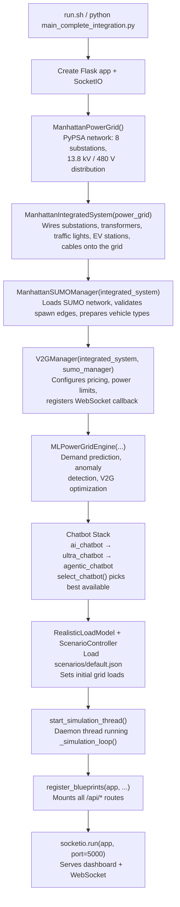
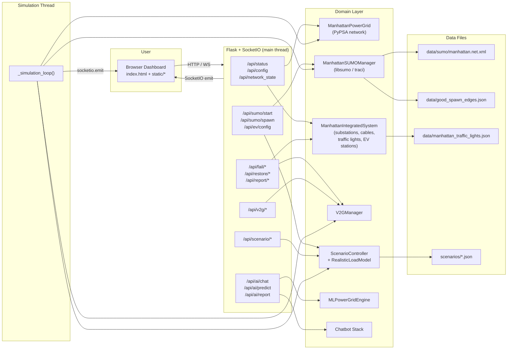

# SumoXPypsa — Project Structure

A co-simulation platform coupling **PyPSA** (power grid analysis) with
**SUMO** (traffic microsimulation) to study Vehicle-to-Grid (V2G) energy
trading on a model of the Manhattan distribution network. The system is
served as a Flask web application with a real-time Mapbox dashboard,
WebSocket updates, and an AI chatbot for operational queries.

---

## Directory and File Structure

```
SumoXPypsa/
│
│  ── Entry & Orchestration ──────────────────────────────────────────
│
├── main_complete_integration.py      # Application entry-point (355 lines)
├── run.sh                            # Launcher (distrobox + venv + .env)
│
│  ── Domain Modules (root) ──────────────────────────────────────────
│
├── integrated_backend.py             # ManhattanIntegratedSystem — canonical
│                                     #   power + traffic integration layer
├── manhattan_sumo_manager.py         # ManhattanSUMOManager (base) — SUMO
│                                     #   vehicle lifecycle via libsumo/traci
├── ev_battery_model.py               # Per-vehicle battery SoC model
├── ev_station_manager.py             # Charging station occupancy tracker
├── v2g_manager.py                    # V2GManager — V2G session, pricing, dispatch
├── realistic_load_model.py           # RealisticLoadModel — physics-based
│                                     #   building/weather/time load profiles
├── scenario_controller.py            # ScenarioController — time, temperature,
│                                     #   load orchestration, overload monitoring
├── scenario_integration.py           # Flask routes for /api/scenario/*
├── ml_engine.py                      # MLPowerGridEngine — demand prediction,
│                                     #   anomaly detection, V2G optimization
├── ai_chatbot.py                     # ManhattanAIChatbot — rule-based assistant
├── ultra_intelligent_chatbot.py      # LLM-backed chatbot (OpenAI-compatible)
├── agentic_chatbot.py                # AgenticChatbot — tool-calling agent
├── agentic_tools.py                  # ToolExecutor — tool definitions for the
│                                     #   agentic chatbot (spawn, fail, query, …)
├── report_generator.py               # PDF report generation (FPDF)
│
│  ── core/ — Power & Traffic Subsystems ─────────────────────────────
│
├── core/
│   ├── power_system.py               # ManhattanPowerGrid — PyPSA network
│   │                                 #   builder (8 substations, 13.8 kV / 480 V)
│   ├── sumo_manager.py               # Extended ManhattanSUMOManager — re-exports
│   │                                 #   base + adds project-specific helpers
│   └── backends.py                   # PowerBackend / TrafficBackend protocols
│
│  ── app/ — Flask Blueprints (route layer) ──────────────────────────
│
├── app/
│   ├── __init__.py                   # register_blueprints() — wires all BPs
│   ├── core_routes.py                # /  /api/status  /api/config  /api/debug/*
│   │                                 #   /api/network_state  /api/export-state
│   ├── sumo_routes.py                # /api/sumo/*  /api/ev/*  /api/simulation/*
│   ├── grid_routes.py                # /api/fail/*  /api/restore/*  /api/report/*
│   │                                 #   /api/snapshot/state
│   ├── v2g_routes.py                 # /api/v2g/*
│   ├── ai_routes.py                  # /api/ai/*  /api/map/*
│   └── perf_routes.py                # /api/perf/snapshot
│
│  ── simulation/ — Background Loop ──────────────────────────────────
│
├── simulation/
│   ├── context.py                    # SimulationContext dataclass, shared
│   │                                 #   system_state dict, vehicle_spawn_queue
│   └── loop.py                       # _simulation_loop() — SUMO stepping,
│                                     #   EV load → PyPSA, power flow, V2G,
│                                     #   WebSocket broadcast
│
│  ── chatbot/ — Chatbot Protocol & Factory ──────────────────────────
│
├── chatbot/
│   ├── base.py                       # Chatbot Protocol (is_available, chat)
│   ├── factory.py                    # select_chatbot() — picks best available
│   ├── intents.py                    # Intent classification for queries
│   └── context.py                    # Conversation context / history
│
│  ── v2g/ — V2G Data Structures ─────────────────────────────────────
│
├── v2g/
│   └── core.py                       # V2GContract, V2GSession dataclasses
│
│  ── config/ ────────────────────────────────────────────────────────
│
├── config/
│   ├── settings.py                   # Pydantic Settings (ports, keys, paths)
│   ├── ev_bus_mapping.py             # EV station → PyPSA bus name mapping
│   └── database.py                   # SQLAlchemy models & DB manager
│
│  ── scenarios/ — Declarative JSON Scenarios ────────────────────────
│
├── scenarios/
│   ├── default.json                  # Startup scenario (midday, 22 °C)
│   ├── rush_hour.json
│   ├── night_low_load.json
│   ├── midday.json
│   └── blackout_test.json
│
│  ── data/ — SUMO Network & Runtime Data ────────────────────────────
│
├── data/
│   ├── good_spawn_edges.json         # Pre-validated edges for vehicle spawning
│   ├── manhattan_connected_network.json  # Connectivity metadata
│   ├── manhattan_traffic_lights.json # Traffic light phase definitions
│   └── sumo/
│       ├── manhattan.net.xml         # SUMO road network (primary)
│       └── types.add.xml            # SUMO vehicle-type definitions
│
│  ── static/ — Frontend Assets ──────────────────────────────────────
│
├── index.html                        # Single-page dashboard (Mapbox, panels)
├── static/
│   ├── styles.css                    # Main CSS
│   ├── chatbot-enhanced-ui.css       # Chatbot panel CSS
│   ├── script.js                     # Dashboard core JS (5 804 lines)
│   ├── world-class-map.js            # Mapbox GL map integration
│   ├── ai-enhanced.js                # AI feature UI
│   ├── ai-functions.js               # AI helper functions
│   ├── scenario-director.js          # Scenario orchestration UI
│   ├── scenario-controls.js          # Scenario control panel
│   ├── chatbot-scenarios.js          # Chatbot ↔ scenario bridge
│   ├── chatbot-scenario-llm.js       # LLM scenario wiring
│   ├── traffic-patterns.js           # Traffic pattern visualization
│   └── time-vehicle-manager.js       # Time-of-day & vehicle controls
│
│  ── tests/ ─────────────────────────────────────────────────────────
│
├── tests/
│   ├── test_route_blueprints.py      # Blueprint route tests (Flask test client)
│   ├── test_scenario_controller.py   # ScenarioController unit tests
│   ├── test_scenario_api.py          # /api/scenario/* integration tests
│   ├── test_scenario_loader.py       # Scenario JSON loading tests
│   ├── test_scenario_init.py         # Default scenario initialization
│   ├── test_full_system.py           # End-to-end system tests
│   ├── test_load_calculation.py      # RealisticLoadModel calculations
│   ├── test_chatbot_factory.py       # Chatbot selection logic
│   ├── test_chatbot_intents.py       # Intent classification
│   ├── test_ev_bus_mapping.py        # EV ↔ PyPSA bus mapping
│   ├── test_settings.py              # Pydantic settings validation
│   ├── test_sumo_helpers.py          # SUMO helper function tests
│   ├── test_v2g_core.py              # V2G dataclass tests
│   └── test_advanced_features.py     # ML / advanced feature tests
│
│  ── Meta & Tooling ─────────────────────────────────────────────────
│
├── pyproject.toml                    # Black / Ruff configuration
├── .env.example                      # Template for required env vars
├── .gitignore
├── README.md
├── LICENSE
├── scripts/
│   ├── setup.py                      # First-time setup wizard
│   ├── setup.sh / setup.bat          # Shell wrappers for setup.py
│   ├── setup_db.py                   # Database initialization
│   ├── start.py                      # Alternative launcher
│   ├── load_data.py                  # Data import helper
│   └── train_models.py              # ML model training
├── docs/                             # User-facing guides
└── website/                          # Standalone demo/conference site
```

---

## How It Works

### Startup Sequence

`main_complete_integration.py` is the sole entry-point. It runs the
following initialization in order:



### Runtime: The Simulation Loop

Once started, a background daemon thread runs `simulation/loop.py` in a
tight physics-timed loop (0.1 s SUMO steps). On each tick it:

1. **Steps SUMO** — advances all vehicles by one simulation step.
2. **Processes the spawn queue** — any vehicles queued via the API are
   injected into SUMO (batched, max 5 per tick).
3. **Updates V2G sessions** — checks active discharge sessions,
   calculates energy delivered and revenue.
4. **Syncs EV loads to PyPSA** — counts vehicles charging at each
   station, maps station → PyPSA bus via `config/ev_bus_mapping.py`,
   and sets load magnitudes on the PyPSA network.
5. **Runs DC power flow** — calls `power_grid.run_power_flow("dc")`
   every 5 simulation-seconds to solve the electrical network.
6. **Broadcasts state** — every 5 physics steps, emits a
   `system_update` WebSocket event containing grid state, vehicle
   positions, V2G dashboard data, and AI focus overlays.

```
  ┌─────────────────── Background Thread ───────────────────┐
  │                                                         │
  │  ┌──────────┐   ┌───────────┐   ┌──────────────────┐   │
  │  │ SUMO     │──▶│ EV Load   │──▶│ PyPSA Power Flow │   │
  │  │ step()   │   │ Sync      │   │ (DC solve)       │   │
  │  └──────────┘   └───────────┘   └──────────────────┘   │
  │       │                                   │             │
  │       ▼                                   ▼             │
  │  ┌──────────┐                    ┌────────────────┐     │
  │  │ V2G      │                    │ Broadcast via  │     │
  │  │ Sessions │                    │ SocketIO       │────────▶ Browser
  │  └──────────┘                    └────────────────┘     │
  │       │                                                 │
  │       ▼                                                 │
  │  ┌───────────────────┐                                  │
  │  │ Spawn Queue       │◀──── POST /api/sumo/spawn        │
  │  │ (from Flask API)  │                                  │
  │  └───────────────────┘                                  │
  └─────────────────────────────────────────────────────────┘
```

### Data Flow



### Thread Model

| Thread | Responsibilities |
|--------|-----------------|
| **Main (Flask/SocketIO)** | Serves HTTP requests and WebSocket connections. All route handlers read domain objects but never block on SUMO calls directly. |
| **Simulation daemon** | Runs the physics loop. Mutates SUMO state, updates PyPSA loads, runs power flow, and emits `system_update` events. Reads the `vehicle_spawn_queue` list to pick up spawn requests from Flask routes. |

Shared mutable state is kept in `simulation/context.py`:
- `system_state` — a dict with keys like `running`, `sumo_running`,
  `simulation_speed`, `current_time`, `scenario`.
- `vehicle_spawn_queue` — a list that Flask routes append to and the
  simulation loop pops from.

### Chatbot Selection

Three chatbot implementations exist, tried in priority order by
`chatbot/factory.py`:

1. **AgenticChatbot** — an LLM agent with tool-calling (spawn vehicles,
   fail substations, query grid state). Requires an OpenAI-compatible
   API endpoint configured via `.env`.
2. **UltraIntelligentChatbot** — LLM-backed but without tool-calling;
   gets a system prompt with grid context.
3. **ManhattanAIChatbot** — fully rule-based, always available.

All three are adapted to a common `Chatbot` protocol
(`chatbot/base.py`) so that `POST /api/ai/chat` works uniformly
regardless of which backend is active.

### Scenario System

`ScenarioController` is the central orchestrator for simulation
conditions. It manages:
- **Time of day** (0–24 h) — drives load curves in `RealisticLoadModel`
- **Temperature** — affects HVAC load multipliers
- **EV spawn directives** — passed through to `ManhattanSUMOManager`
- **Forced failures** — triggers substation outages for testing
- **Substation overload monitoring** — automatically trips substations
  that exceed capacity thresholds

Scenarios are defined as JSON files in `scenarios/` and loaded via
`ScenarioController.load_scenario_file()`. The default scenario
(`scenarios/default.json`) is applied at startup to set initial grid
loads through the standard path rather than hardcoded values.

The `/api/scenario/*` endpoints (registered via `scenario_integration.py`)
expose time, temperature, vehicle, and failure controls to the dashboard.

---

## API Route Map

| Blueprint | Prefix | Key Endpoints |
|-----------|--------|---------------|
| `core_routes` | `/` | `GET /` (dashboard), `/api/status`, `/api/config`, `/api/network_state`, `/api/debug/*`, `/api/export-state` |
| `sumo_routes` | `/api/sumo` | `POST /start`, `POST /stop`, `POST /spawn`, `POST /scenario`; `/api/ev/config`, `/api/simulation/speed` |
| `grid_routes` | `/api/fail` | `POST /api/fail/<sub>`, `POST /api/restore/<sub>`, `/api/snapshot/state`, `/api/report/generate`, `/api/restore_all` |
| `v2g_routes` | `/api/v2g` | `POST /enable/<sub>`, `POST /disable/<sub>`, `/status`, `POST /start_session`, `POST /test` |
| `ai_routes` | `/api/ai` | `POST /chat`, `POST /predict`, `GET /report`, `POST /v2g/optimize`, `/enhanced/*`, `/api/map/focus` |
| `scenario_integration` | `/api/scenario` | `POST /set_time`, `POST /set_temperature`, `POST /add_vehicles`, `POST /run_scenario`, `GET /status`, `GET /forecast`, `GET /dashboard`, `POST /load_file` |
| `perf_routes` | `/api/perf` | `GET /snapshot` |

---

## Key Data Files (loaded at runtime)

| File | Loaded By | Purpose |
|------|-----------|---------|
| `data/sumo/manhattan.net.xml` | `manhattan_sumo_manager.py` | SUMO road network definition |
| `data/sumo/types.add.xml` | `manhattan_sumo_manager.py` | SUMO vehicle type parameters |
| `data/good_spawn_edges.json` | `manhattan_sumo_manager.py` | Pre-validated edges for reliable vehicle spawning |
| `data/manhattan_connected_network.json` | `manhattan_sumo_manager.py`, `core/sumo_manager.py` | Network connectivity metadata |
| `data/manhattan_traffic_lights.json` | `integrated_backend.py` | Traffic light phase configurations |
| `scenarios/*.json` | `scenario_controller.py` | Declarative simulation scenarios |
| `.env` | `main_complete_integration.py` | API keys, model endpoints |

---

## Running the Application

```bash
# Inside the distrobox container:
./run.sh
# Or manually:
source venv/bin/activate
export SUMO_HOME=/usr/share/sumo
export PYTHONPATH="${SUMO_HOME}/tools:${PYTHONPATH}"
python main_complete_integration.py
```

The dashboard is served at **http://localhost:5000**.

## Running Tests

```bash
pytest tests/ -v
```
